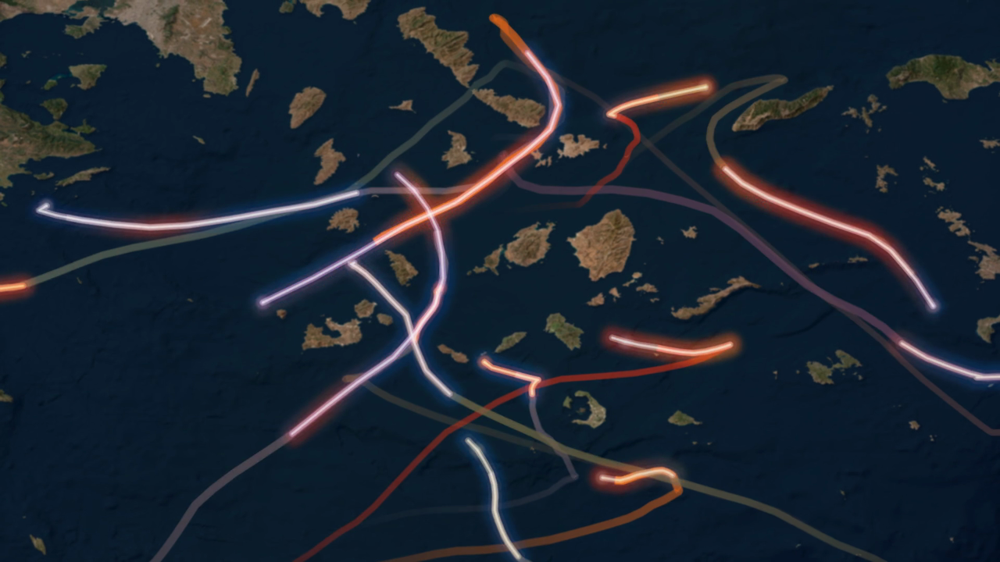
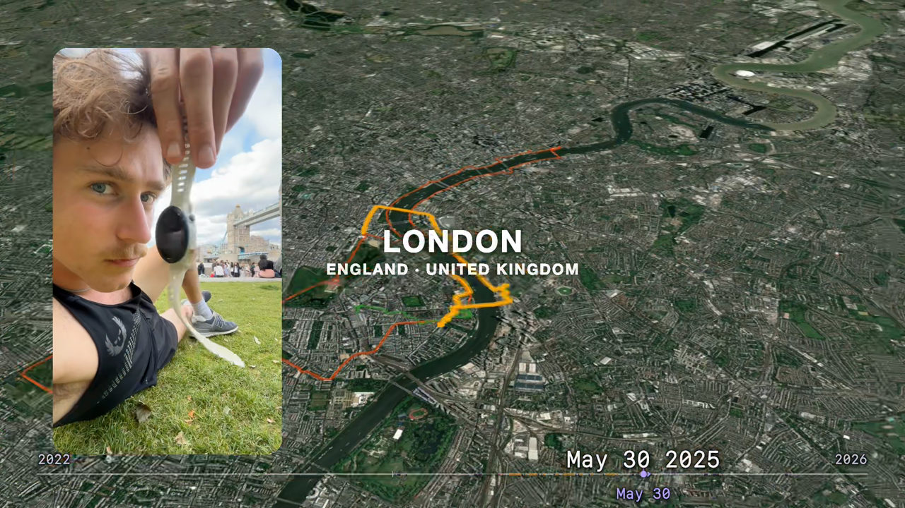
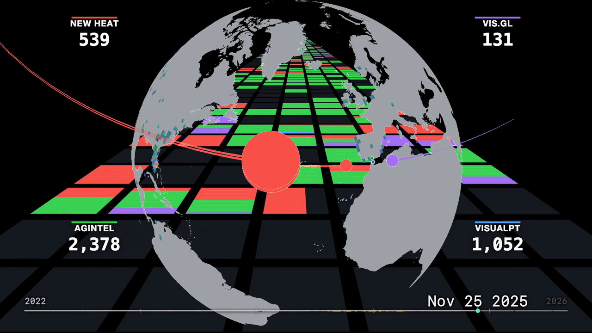
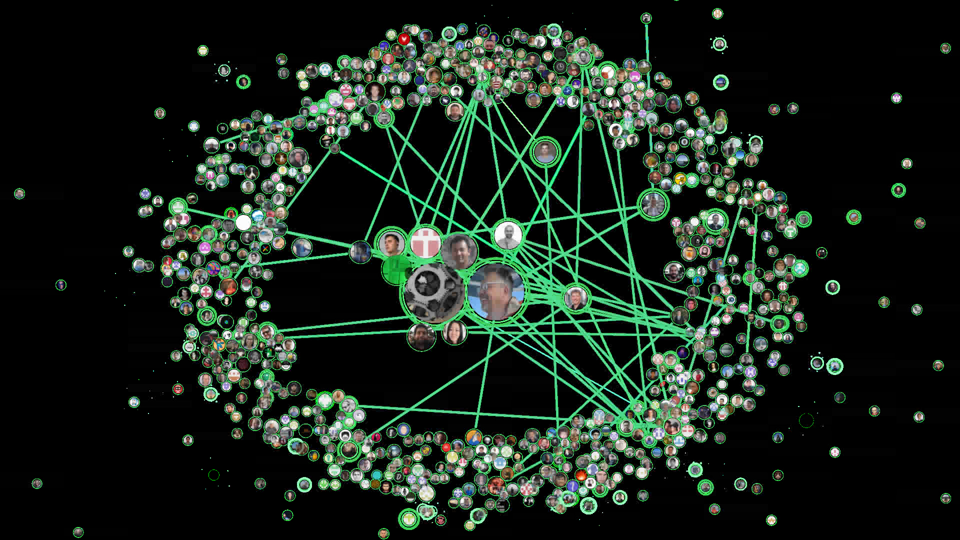
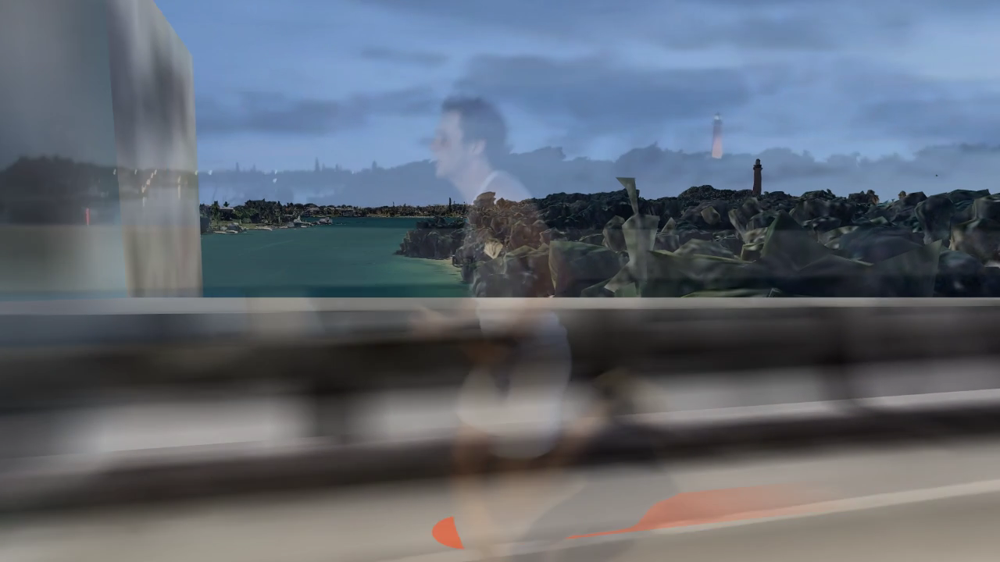
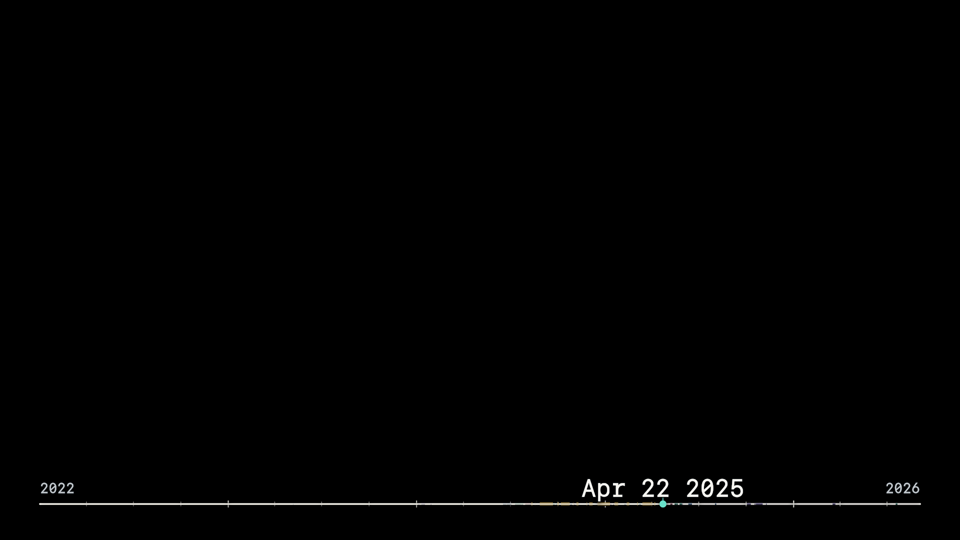

# NEWHEAT Summit 2026

The aim of this project was to build a Summit presentation and its visual stories with **vis.gl and Codex** — from animated routes and contribution histories to live demos and transitions between maps and real footage.

[**Watch on YouTube →**](https://www.youtube.com/watch?v=Rp-f-tjqKck)

The visuals evolved through many small iterations. This repository keeps the latest source and selected screenshots. Thanks to [**@ibgreen**](https://github.com/ibgreen) for his support.

| Preview | Explore the source |
|---|---|
|  | [Authorship opening](opening/) — Glowing routes across the Cyclades. |
|  | [Geographic rewind](rewind/) — Activity routes, memories, and journeys through time. |
|  | [Personal contribution history](personal/) — Contributions across organizations, calendars, and places. |
|  | [vis.gl community](community/) — Contributors and connections across the ecosystem. |
|  | [Closing film](closing/) — Moving from the map into real footage and back. |
|  | [Unified date overlay](timecode/) — A shared date axis for the film. |
|  | [Presentation and live demos](slides/) — Talk cues, slides, and interactive demos. |

Each folder contains its scripts and setup notes. To get started with the slides, use Node.js 22.5+:

```sh
npm ci --legacy-peer-deps
npm run slides:build
npm run slides
```

Original code is [MIT licensed](LICENSE): use it, adapt it, and build on it. This is an experimental creative archive; some renderers need private inputs and provider credentials. [Input recovery](RECOVERY.md) · [Map and media credits](THIRD_PARTY.md).
