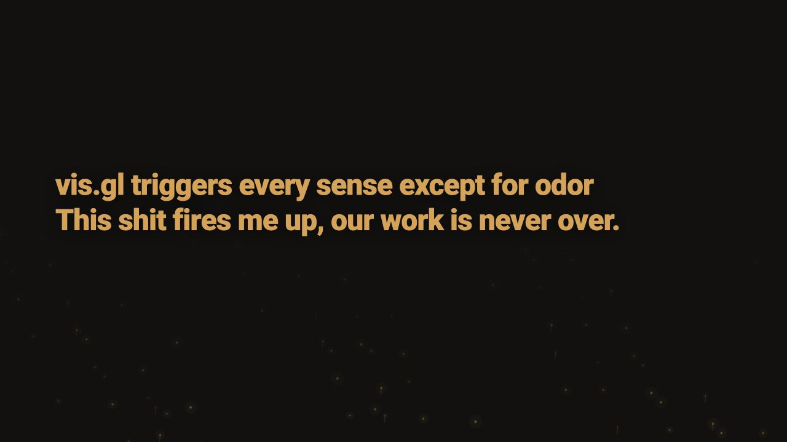

# Presentation and live demos

The spoken story, editable slide cues and interactive demonstrations used around the film.



| Part | Source |
| --- | --- |
| Talk and cues | [Spoken script](talk.txt), [running order](RUNNING_ORDER.json), [slide definitions](slides/) |
| Slide playback | [App](app.js), [renderer](renderer.js), [visual scenes](scenes/) |
| TreeLayer demo | [Demo](tree-demo/), [launcher](tree-server.mjs) |
| thor.gl demo | [Demo](thor-demo/), [launcher](thor-server.mjs) |
| Presenter controls | [Speaker view](speaker.html), [server](speaker-server.mjs) |

There is one active copy of each demo. `vendor/` preserves the exact controller, TreeLayer and thor.gl source used by them; these modules contribute to the demonstrations. `tests/` covers the slide model, controls and demo contracts.

From the repository root after dependency setup:

```sh
npm run slides:build
npm run slides
```

Large videos and private captures are excluded, so this is not a complete offline playback package. The demos have not received a fresh browser acceptance pass during curation.

[Watch the film](https://www.youtube.com/watch?v=Rp-f-tjqKck) · [Verification](../VERIFY.json)
